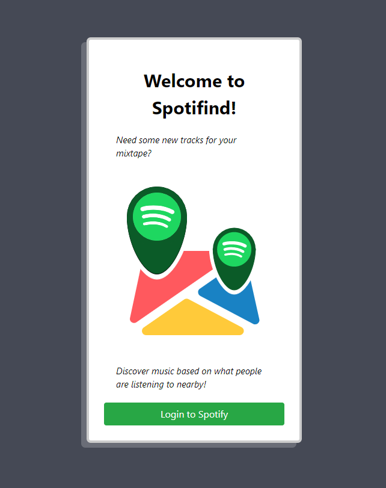
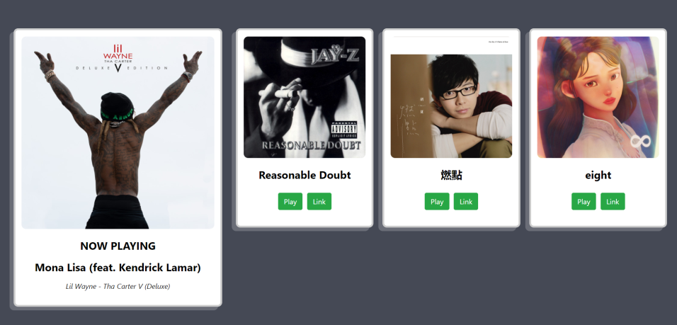

# Spotifind

  
  

## Inspiration
As humans, we all have unique tastes in music. Most of us tend to prefer specific genres and create playlists based on our personalized tastes. However, **we often get bored with the songs we listen to day after day, hoping to try something new or see what the people around us are listening to.** For example, you might want to find out what music the guy across the room is nodding his head to, or maybe you're on a vacation, and you want to find out what some of the locals are listening to. As of now, **there is no good way to satisfy your curiosity**, other than going over to someone, interrupting their music, and asking them what they're listening to. **What if there was an intuitive way and streamlined way to connect people's music tastes?**

## What it does
With this problem in mind, our team designed Spotifind, an application that allows you to use your Spotify account and **choose from a list of recommended songs which are curated from nearby users**. Each nearby person's music tastes are compared to yours, and **we sort them using a machine learning algorithm so that songs that are most similar to the user's current top tracks and artists will be displayed first**. So you can either start at the top and work your way down, or start at the bottom and work your way up, depending on whether you want to listen to music you're likely to enjoy, or just find out what crazy new music is out there. From this list, users have the choice to either play the song directly through the web app, or go to the song itself on Spotify.

## How we built it
We built the **frontend using React** and the **backend using Python**, connecting the two through **Flask/SocketIO**. We used the **Spotify API** to collect music data about individual users, such as their top songs and artists. To get user location, we simply used the the **web browser geolocation API**, which gave us a latitude and longitude. To check if two people are nearby, we used the **haversine formula** to calculate the distance between them based on their latitude and longitude. Finally, we used a  **k-nearest neighbors algorithm** to calculate similarity between users, so that the music they see is sorted in order of most to least similar to their own preferences. Everything was deployed using Heroku.

## Challenges we ran into
We had some trouble with updating the users currently logged in to the website, because we wanted to add and remove users in real-time in our display. This ended up being due to us overwriting data, which caused users to never be added. In addition, we had to rewrite our original Javascript server in Python, because Heroku only allowed one server.

## Accomplishments that we're proud of
**Our biggest accomplishment was being able to combine our React frontend and Python backend using Flask to create a robust application.** We had to stitch together a variety of elements, including sending data both ways between React and Python. Though we initially ran into problems with getting everything to work together nicely, finally connecting all the pieces and seeing it all work in tandem was incredibly rewarding.

## What we learned
This was all our first times using Flask, and we initially had a lot of trouble understanding how exactly Flask sent data between our Python code and our Javascript code. In addition, we were able to brush up on some skills we hadn't used in a while, such as working with the Python requests module and applying the K-nearest neighbors algorithm.

## What's next for Spotifind
Currently, Spotifind is primarily a song recommender based on location and the user's tastes. **We hope to expand the scope of the application, and eventually add features such as allowing users to add social media accounts and learn playlists.** Our vision of Spotifind is a platform where people can find connections with others they never would have met otherwise, through the universal language of music.

